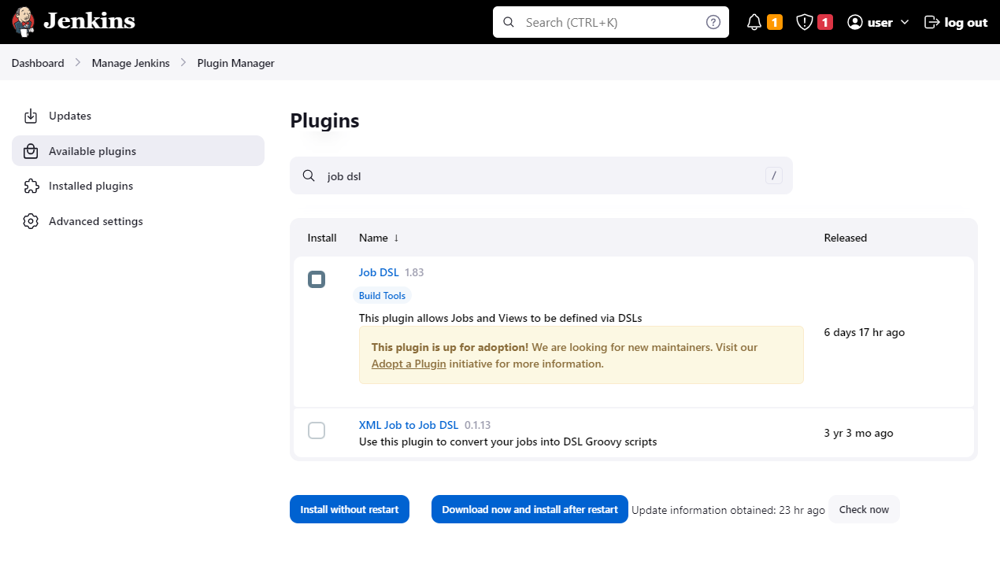
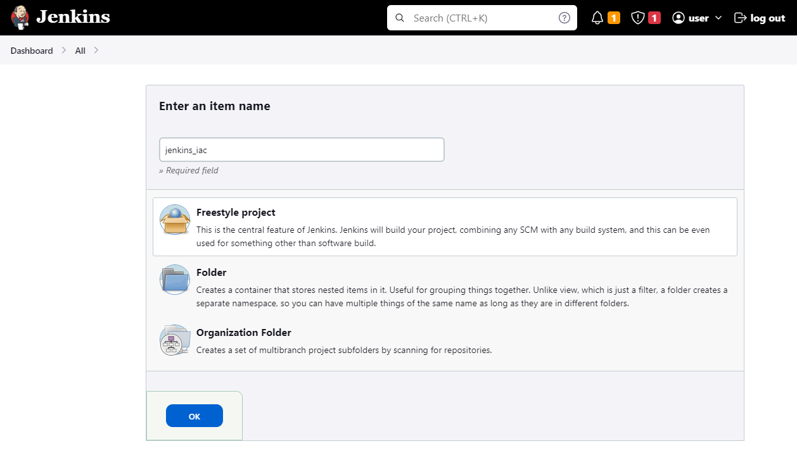
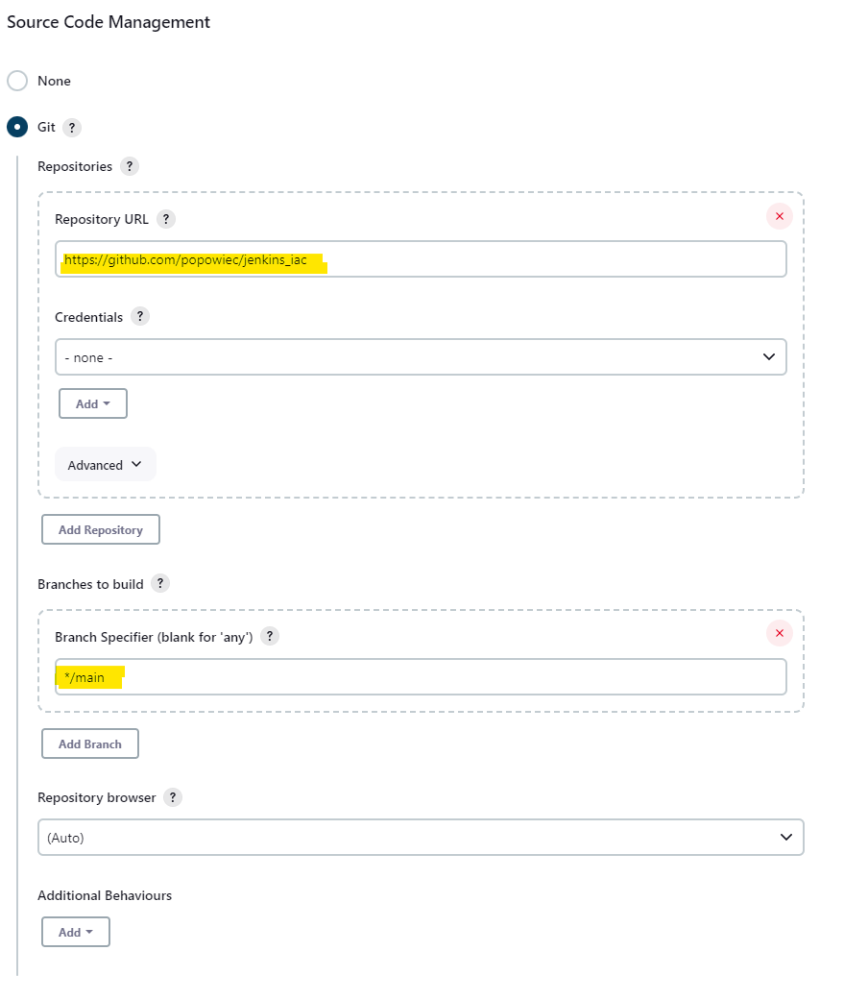
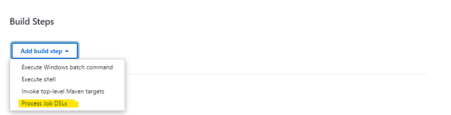
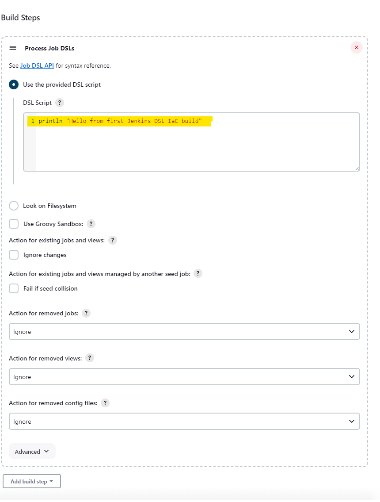
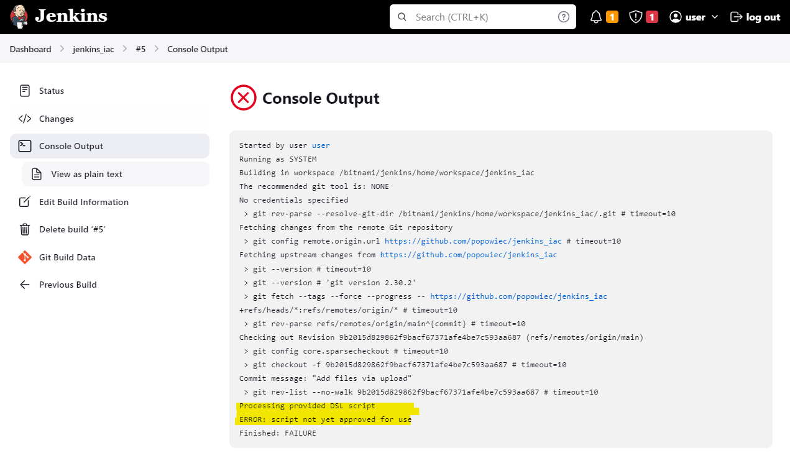
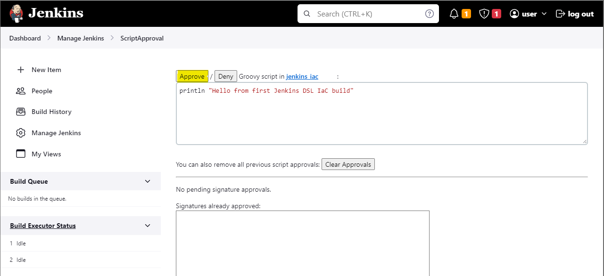
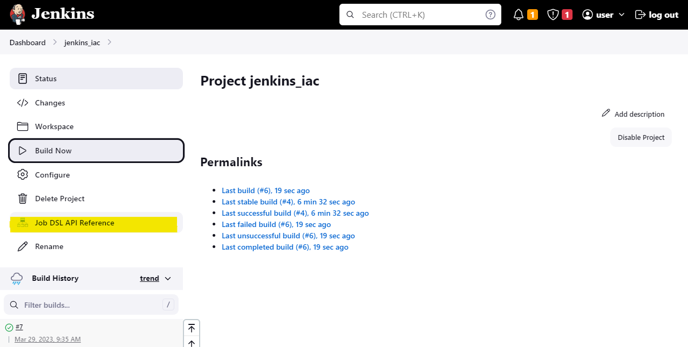
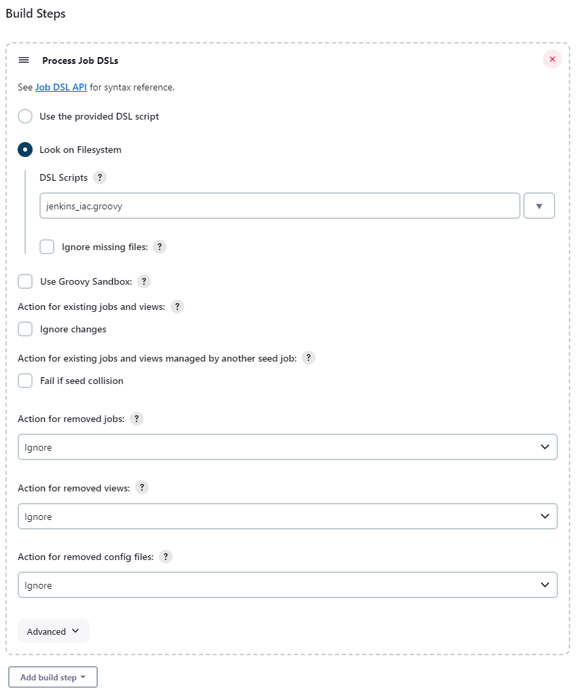

# jenkins_iac

> ***internal use for my colleagues*** -
> we will use the container jenkins prepared by [BITNAMI](https://bitnami.com/stack/jenkins/containers)

> install docker [Install using the apt repository](https://docs.docker.com/engine/install/ubuntu/#install-using-the-repository) [Linux post-installation steps for Docker Engine](https://docs.docker.com/engine/install/linux-postinstall/)

 ### 1. Linux on WSL or EC2 with "tree" command installed
    - check tree command: "tree -J ~" *(as a result you should see the json output with the folder and file structure)*
 ### 2. clone this repository
 ```
 https://github.com/popowiec/jenkins_iac.git
 ```
 ### 3. install Jenkins as docker container:
    - execute "docker compose up" or "docker compose up -d"
    - Jenkins is available on http://localhost
    - login: user
    - pass: bitnami
 ### 4. In the "jenkins_jobs" folder we will create our jenskis iac projects:
 
 The idea is to cretae jenkins projects and jobs based on folder structres in the root folder "jenkins_jobs":
 
```
├── jenkins_jobs                    -> [configuration root path]
│   ├── ProjectA                    -> [project/root path]
│   │   ├── ModuleA                 -> [project/sub-project path]
│   │   │   ├── JobA.jenkinsfile    -> [build/job path and config file]
│   │   │   ├── JobB.jenkinsfile    -> [build/job path and config file]
│   │   │   └── JobC.jenkinsfile    -> [build/job path and config file] 
```

### 5. Install jenkins "Job DSL plugin" and "Git plugin" 



### 6. Create first "DSL IAC" job:



### 7. Config SCM part of DSL job:



### 8. Configure Build steps part for DSL job:





### [In-process Script Approval](https://www.jenkins.io/doc/book/managing/script-approval/)



### 9. Job DSL API reference



### 10. Config Build steps to use groovy script file from repository:
> ***remeber to Approve the script in Manage Jenkins > scriptApproval***



